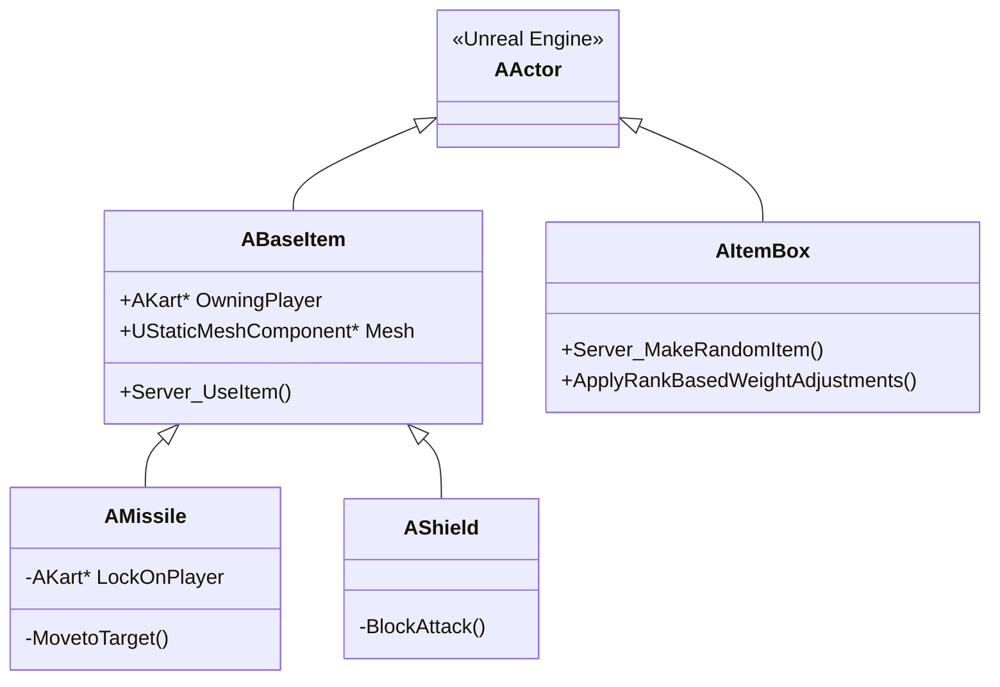
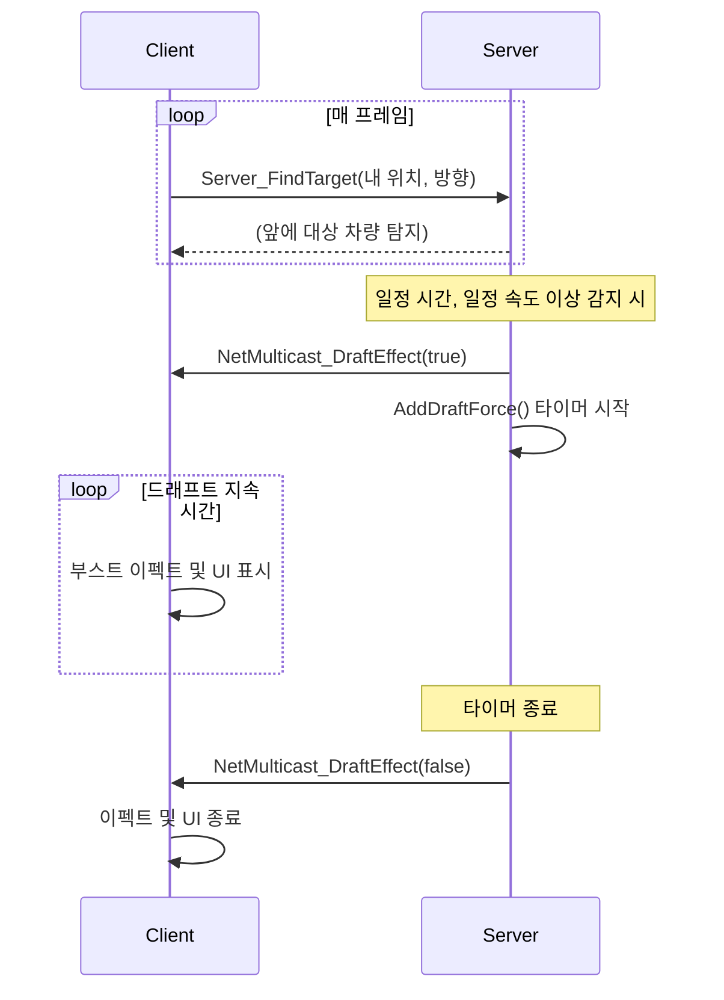

# ProjectR: 언리얼 엔진 기반 멀티플레이어 카트 레이싱 게임

저는 이 프로젝트에서 플레이어에게 다채로운 변수를 제공하고, 역전의 재미를 더하는 두 가지 핵심 시스템, **아이템 시스템**과 **드래프트 시스템**의 설계와 구현을 담당했습니다.

이 문서는 제가 구현한 시스템들의 기술적인 접근 방식, 해결 과제, 그리고 성과를 공유하기 위해 작성되었습니다.

## 1. 아이템 시스템

카트 레이싱의 핵심 재미 중 하나는 아이템을 활용한 예측 불가능한 경쟁입니다. 저는 단순한 기능 나열을 넘어, 플레이어의 상황에 따라 동적으로 변화하고 네트워크 환경에서 안정적으로 동작하는 아이템 시스템을 구축하고자 했습니다.

### 1.1. 아키텍처: 확장성과 안정성을 고려한 설계

아이템 시스템은 서버 중심(Server-Authoritative) 아키텍처를 기반으로 설계하여 모든 아이템의 생성, 획득, 사용 로직이 서버에서만 처리되도록 보장했습니다. 이를 통해 클라이언트 조작을 원천적으로 차단하고 모든 플레이어에게 공정한 게임 환경을 제공합니다.

- **`BaseItem`**: 모든 아이템의 기반이 되는 추상 클래스입니다. 아이템 소유자(`OwningPlayer`), 네트워크 복제 등 공통 로직을 처리하여 새로운 아이템을 손쉽게 추가할 수 있는 확장성을 확보했습니다.
- **`ItemBox`**: 플레이어가 아이템을 획득하는 매개체입니다. 플레이어와의 충돌 감지 시 서버에 아이템 생성을 요청하는 역할을 합니다.
- **구체적인 아이템들 (`Missile`, `Shield` 등)**: `BaseItem`을 상속받아 각 아이템의 고유한 동작을 구현합니다.


<!-- 제안: 아이템 획득부터 사용까지의 전체 과정을 보여주는 시퀀스 다이어그램 -->

### 1.2. 핵심 기능 및 구현 내용

#### 동적 밸런싱: 등수 기반 아이템 확률 조정

게임의 긴장감을 끝까지 유지하기 위해, 하위권 플레이어에게 역전의 기회를 제공하는 동적 밸런싱 시스템을 도입했습니다. 플레이어가 아이템 박스를 획득하는 순간, 서버는 해당 플레이어의 현재 등수를 기반으로 아이템 목록의 가중치를 실시간으로 재계산합니다.

- **구현**: `ApplyRankBasedWeightAdjustments` 함수에서 플레이어의 등수(`PlayerRank`)와 전체 플레이어 수(`MaxPlayers`)를 이용해 정규화된 순위 값을 계산합니다. 이 값을 사용하여 아이템 유형(부스터, 공격, 방어)별 가중치 계수를 동적으로 조절합니다.
- **성과**: 하위권일수록 부스터 아이템 획득 확률이, 상위권일수록 방어 아이템 획득 확률이 높아지도록 설계하여, 고착화될 수 있는 레이스 순위에 지속적인 변수를 창출하고 플레이어에게 전략적인 선택의 재미를 제공했습니다.

```cpp
// C:/Users/zero9/Documents/Github/ProjectR/Source/ProjectR/KartGame/Items/ItemBox.cpp

void AItemBox::ApplyRankBasedWeightAdjustments(TMap<int32, FItemTable>& ItemMapToAdjust, int32 PlayerRank)
{
    // ... (변수 선언)

	const int32 MaxPlayers = GetWorld()->GetNumControllers();
	
    // 꼴등일수록 높은 값을 가지는 부스터 계수
	float BoosterBoostFactor = FMath::Clamp((float)PlayerRank / MaxPlayers, 0.0f, 1.0f);
	
    // 중간 등수에서 가장 높은 값을 가지는 공격 계수 (포물선 활용)
	float AttackBoostFactor = 1.0f - 4.0f * FMath::Pow(((float)PlayerRank / MaxPlayers) - 0.5f, 2);
	
    // 1등일수록 높은 값을 가지는 방어 계수
	float DefenseBoostFactor = FMath::Clamp(1.0f - ((float)PlayerRank - 1) / (MaxPlayers - 1), 0.f, 1.f);

	for (auto& Item : ItemMapToAdjust)
	{
        // ... (아이템 ID에 따라 WeightMultiplier 적용)
		Item.Value.ItemWeight = FMath::FloorToInt(Item.Value.ItemWeight * WeightMultiplier);
	}
}
```
<!-- 제안: 등수(X축)에 따른 아이템 타입별 획득 확률(Y축) 변화를 보여주는 그래프 -->

#### 유도 미사일

단순히 목표를 따라가는 것을 넘어, 살아있는 듯한 움직임을 보여주는 유도 미사일을 구현했습니다.

- **구현**: `MovetoTarget` 함수에서 삼각함수(`sin`, `cos`)를 이용하여 미사일이 목표를 향해 날아가면서 좌우상하로 파동치며 움직이도록 구현했습니다. 또한 목표와의 거리에 따라 속도와 파동의 세기를 조절하여 더욱 역동적인 시각적 효과를 만들어냈습니다. 모든 이동 계산은 서버에서 수행 후 `NetMulticast` RPC를 통해 클라이언트에 동기화됩니다.
- **성과**: 플레이어에게 시각적 재미를 선사함과 동시에, 예측하기 어려운 미사일 궤적을 통해 방어 아이템 사용이나 회피 기동 등 추가적인 상호작용을 유도했습니다.

<!-- 제안: 실제 미사일이 파동치며 날아가는 플레이 영상 (GIF 또는 짧은 비디오) -->

## 2. 드래프트 시스템

드래프트(슬립스트림)는 추격하는 플레이어에게 순간적인 부스트를 제공하여, 레이스의 속도감을 높이고 플레이어 간의 상호작용을 증대시키는 핵심 시스템입니다.

### 2.1. 아키텍처: 정확한 판정과 즉각적인 피드백

드래프트 시스템 역시 서버 중심 아키텍처를 채택하여 판정의 정확성을 보장했습니다. 클라이언트가 드래프트 조건 충족 여부를 지속적으로 서버에 질의하고, 서버의 최종 판정에 따라 모든 클라이언트가 동일한 효과를 경험하도록 설계했습니다.



### 2.2. 핵심 기능 및 구현 내용

#### 서버 기반 탐지 및 조건부 발동

정확하고 공정한 판정을 위해 드래프트 대상 탐지 로직을 서버에서 수행하도록 구현했습니다.

- **구현**: `TickComponent`에서 주기적으로 `Server_FindTarget` RPC를 호출합니다. 서버는 `SweepMultiByChannel`(박스 트레이스)을 사용하여 전방의 다른 카트를 탐지합니다. 특정 카트 뒤에서 일정 시간(`DraftStartTime`) 이상, 일정 속도 이상으로 주행하는 조건이 충족되면, 서버는 `bDraftStart` 변수를 `true`로 설정하고 이 상태를 모든 클라이언트에 복제합니다.
- **성과**: 모든 판정이 서버에서 이루어지므로 네트워크 지연이나 클라이언트 조작에 의한 부작용 없이 모든 플레이어가 동일한 조건에서 드래프트를 경험할 수 있습니다. 또한, UI 프로그레스 바를 통해 플레이어가 드래프트 발동까지 남은 시간을 시각적으로 인지할 수 있도록 하여 긍정적인 사용자 경험을 제공했습니다.

#### 물리 기반 부스트 효과

드래프트 발동 시, 카트의 가속을 물리적으로 직접 제어하여 현실감 있는 부스트 효과를 구현했습니다.

- **구현**: `AddDraftForce` 함수에서 카트의 `UBoxComponent`에 `AddForceAtLocation`을 사용하여 실제 힘을 가합니다. 힘은 카트의 질량과 `DraftForce` 값을 기반으로 계산되며, 각 바퀴의 위치에 적용하여 안정적인 가속을 구현했습니다.
- **성과**: 단순한 속도 값 변경이 아닌, 물리 시뮬레이션에 직접 개입함으로써 다른 물리적 요소(충돌, 마찰 등)와 자연스럽게 상호작용하는, 무게감 있고 박진감 넘치는 부스트 효과를 만들어냈습니다.

```cpp
// C:/Users/zero9/Documents/Github/ProjectR/Source/ProjectR/KartGame/Kart/Components/KartDraftComponent.cpp

void UKartDraftComponent::AddDraftForce()
{
    // ... (컴포넌트 가져오기)
	auto* KartBody = Cast<UBoxComponent>(Kart->GetRootComponent());
	
    // 카트의 질량을 고려한 힘 계산
	FVector force = KartBody->GetForwardVector() * KartBody->GetMass() * DraftForce;
    
    // 각 바퀴에 힘을 가하여 안정적인 가속 구현
	for (int32 i = 0; i < AccelerationComponent->GetWheels().Num(); i++)
	{
		FVector location = AccelerationComponent->GetWheels()[i]->GetComponentLocation();
		KartBody->AddForceAtLocation(force, location);
	}
}
```
<!-- 제안: 드래프트 UI(게이지)가 차오르고, 부스트가 발동되는 실제 플레이 영상 -->

## 3. 결론

ProjectR의 아이템 및 드래프트 시스템 개발은 단순히 기능을 구현하는 것을 넘어, 멀티플레이어 환경에서의 안정성, 게임의 밸런스, 그리고 플레이어의 경험까지 고려해야 하는 도전적인 과제였습니다. 저는 서버 중심 아키텍처에 대한 깊은 이해를 바탕으로 확장 가능하고 안정적인 시스템을 구축했으며, 동적 밸런싱과 물리 기반 제어 등 기술적인 디테일을 통해 게임의 재미를 한층 더 끌어올리고자 노력했습니다.

이 프로젝트를 통해 저의 기술적 성장은 물론, 팀원들과 함께 문제를 해결하고 더 나은 게임을 만들어가는 즐거움을 느낄 수 있었습니다.
